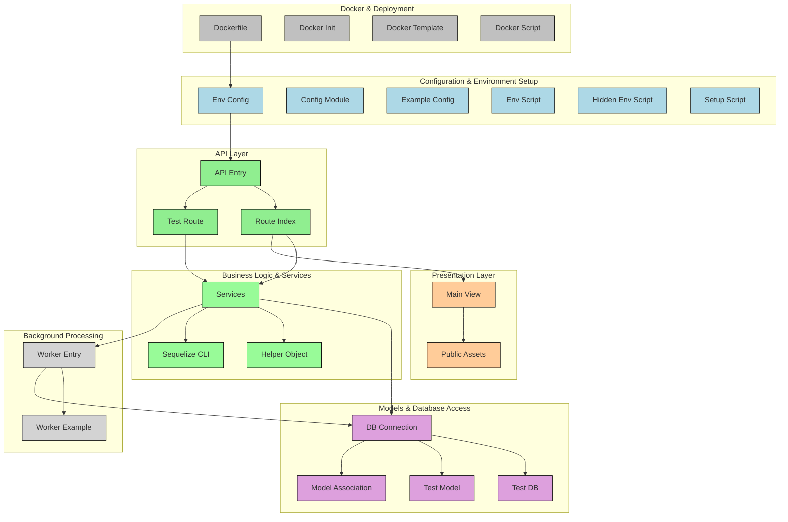

# JIGS NODEJS 
By [Maxminlevel](mailto:vovantoan.dev@gmail.com) 

<a href="https://packagist.org/packages/laravel/framework"></a>
</p>

## About 

JIGS NODEJS is a template framework for NodeJS. JIGS NODEJS attempts to take the pain out of development by easing common tasks used in the majority of NodeJS/web projects, such as:

- [x] Clean architecture
- [x] Singleton design pattern
- [ ] Custom midleware
  - [ ] Forward router
  - [ ] Build message through midleware
- [x] Simple setup routing engine.
- [ ] Support many type database
  - [ ] MongoDB
  - [x] PostgreSQL
- [x] Server Side Rendering
  - [x] I18n
  - [x] Handlebars
- [x] Robust background job processing with Node-cron
- [x] Easily unit testing (Jest)
- [ ] Webpack and babel
- [x] Script for hide enviroment (.env, docker-compose, ...)
- [x] Docker setup for build image and enviroment.

The idea is build a context contain all services we need. We will require only in the first time instead call require any where.



## Setup

See more in [Guide.md](./Guide.md)


## License

The JIGS NODEJS framework is open-sourced software licensed under the [MIT license](./LICENSE) and Drinkware License below
```
THE DRINKWARE LICENSE

<vvtoan35@gmail.com> wrote this file. As long as 
you retain this :x:tice you can do whatever you want 
with this stuff. If we meet some day, and you think 
this stuff is worth it, you can buy me the following
drink(s) in return.

Red Bull
Coffee
Sprite
Cola
Beer
etc

Toan Vo Van
```
